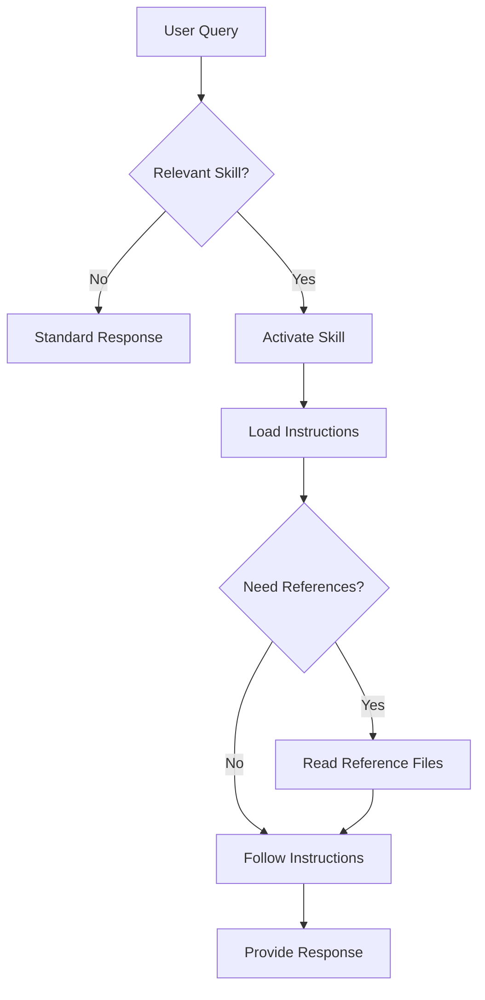

# Agent Skills

Agent Skills extend SAI's capabilities with specialized knowledge and workflows. Skills are self-contained packages that teach the agent how to perform specific tasks.

## What are Agent Skills?

Agent Skills is a [standard format](https://agentskills.io/specification) for extending AI agents with:

- **Specialized knowledge** - Domain expertise, best practices
- **Workflows** - Step-by-step procedures
- **Tools** - Scripts and executables
- **Reference materials** - Documentation, templates, examples

Each skill is a folder with:

- `SKILL.md` - Instructions and metadata (required)
- `scripts/` - Executable scripts (optional)
- `references/` - Documentation files (optional)
- `assets/` - Templates, resources (optional)

## Skill Structure

```
my-skill/
├── SKILL.md              # Main skill file (required)
├── scripts/              # Optional: executable scripts
│   ├── analyze.sh
│   └── report.py
├── references/           # Optional: documentation
│   ├── best-practices.md
│   └── examples.md
└── assets/               # Optional: templates, configs
    └── template.yaml
```

## SKILL.md Format

Every skill must have a `SKILL.md` file with YAML frontmatter:

```markdown
---
name: code-review
description: Reviews code for quality, security, and best practices
category: development
author: Your Name
version: 1.0.0
---

# Code Review Skill

## Instructions

When asked to review code, follow these steps:

1. **Understand Context**
   - What type of code is this?
   - What's the intended purpose?

2. **Check Quality**
   - Code readability and style
   - Best practices compliance
   - Error handling

3. **Security Review**
   - Input validation
   - Authentication/authorization
   - Common vulnerabilities

4. **Performance**
   - Algorithmic efficiency
   - Resource usage
   - Scalability concerns

## Output Format

Provide feedback in this structure:

### Summary
[Brief overview]

### Issues Found
- **Critical**: [Description]
- **Medium**: [Description]
- **Minor**: [Description]

### Recommendations
[Actionable suggestions]
```

## Using Skills

### Discovery Mode (Default)

By default, SAI discovers skills from `~/.config/sai/skills/`:

```bash
# Skills are automatically discovered
java -jar target/sai-1.0-SNAPSHOT.jar
```

The agent can then:

1. **List skills** - See available skills
2. **Activate skills** - Load instructions when needed
3. **Use skills** - Follow the loaded instructions

### Single Skill Mode

Load a specific skill directly:

```bash
java -jar target/sai-1.0-SNAPSHOT.jar --skill /path/to/skill-directory
```

In single-skill mode:
- Skill instructions are injected directly
- No activation needed
- Perfect for dedicated workflows

### In Personas

Configure skills in persona files:

```yaml
agentId: expert-reviewer
name: Expert Reviewer
description: Code reviewer with specialized skills

skillDirectories:
  - ~/.config/sai/skills    # Standard location
  - ./project-skills         # Project-specific skills

skillNames:
  - code-review              # Auto-load this skill
  - security-audit           # And this one
```

## Creating a Skill

### Step 1: Create the Directory

```bash
mkdir -p ~/.config/sai/skills/my-skill
cd ~/.config/sai/skills/my-skill
```

### Step 2: Write SKILL.md

```bash
cat > SKILL.md << 'EOF'
---
name: my-skill
description: What this skill does and when to use it
category: general
author: Your Name
version: 1.0.0
---

# My Skill

## When to Use

Use this skill when the user asks to [describe trigger].

## Instructions

Step-by-step instructions for the agent:

1. **First, gather information**
   - Ask clarifying questions if needed
   - Confirm assumptions

2. **Then, perform the task**
   - Follow these specific steps
   - Use these tools/commands

3. **Finally, present results**
   - Format output clearly
   - Suggest next steps

## Example

User: "Do X"

Agent: [Example response following these instructions]
EOF
```

### Step 3: Test the Skill

```bash
# Test in single-skill mode
java -jar target/sai-1.0-SNAPSHOT.jar --skill ~/.config/sai/skills/my-skill
```

## Example Skills

### Code Review Skill

```markdown
---
name: code-review
description: Reviews code for quality, security, and maintainability
category: development
---

# Code Review Skill

## Instructions

When reviewing code:

1. **Code Quality**
   - Readable and maintainable
   - Follows conventions
   - Well-documented

2. **Functionality**
   - Meets requirements
   - Handles edge cases
   - Error handling present

3. **Security**
   - Input validation
   - No hardcoded secrets
   - Secure dependencies

4. **Performance**
   - Efficient algorithms
   - No obvious bottlenecks
   - Scalable design

## Output Format

### Summary
[One sentence overview]

### Strengths
- [Positive aspect 1]
- [Positive aspect 2]

### Issues
- **🔴 Critical**: [Must fix]
- **🟡 Medium**: [Should fix]
- **🔵 Minor**: [Nice to have]

### Recommendations
[Specific, actionable suggestions]
```

### Documentation Generator Skill

```markdown
---
name: doc-generator
description: Generates clear, comprehensive documentation from code
category: documentation
---

# Documentation Generator Skill

## Instructions

When generating documentation:

1. **Understand the Code**
   - Read all relevant files
   - Identify key components
   - Note dependencies

2. **Structure the Documentation**
   ```
   # Component Name
   
   ## Overview
   [What it does]
   
   ## Usage
   [How to use it]
   
   ## API Reference
   [Detailed reference]
   
   ## Examples
   [Code examples]
   ```

3. **Include Examples**
   - Real, working code
   - Common use cases
   - Edge cases

4. **Explain Trade-offs**
   - When to use
   - When not to use
   - Alternatives
```

### Shell Script Helper

```markdown
---
name: shell-helper
description: Helps write safe, robust shell scripts
category: scripting
---

# Shell Script Helper Skill

## Instructions

When writing shell scripts:

1. **Always include**
   ```bash
   #!/usr/bin/env bash
   set -euo pipefail  # Exit on error, undefined vars, pipe failures
   ```

2. **Use meaningful names**
   - Variables: `input_file` not `f`
   - Functions: `validate_input` not `vi`

3. **Check prerequisites**
   ```bash
   command -v jq >/dev/null 2>&1 || {
     echo "Error: jq is required"
     exit 1
   }
   ```

4. **Handle errors**
   ```bash
   if ! mv "$source" "$dest"; then
     echo "Error: Failed to move file"
     exit 1
   fi
   ```

5. **Quote variables**
   ```bash
   rm "$file"      # ✓ Good
   rm $file        # ✗ Bad (word splitting)
   ```
```

## Skill Tools

### Available Tools

When skills are enabled, these tools are available:

```python
# List all discovered skills
list_skills()

# Activate a skill (load full instructions)
activate_skill(skill_name)

# Read a reference file from an activated skill
read_skill_reference(skill_name, reference_file)
```

### Example Usage

In your SKILL.md:

```markdown
## Instructions

1. First, check the reference documentation:
   - Read `references/best-practices.md` for guidelines
   - Read `references/examples.md` for examples

2. Then execute the appropriate script:
   - Run `scripts/analyze.sh` for analysis
   - Run `scripts/report.py` to generate reports

3. Format the output according to the templates:
   - Use `assets/report-template.md` as a guide
```

## Advanced: Skills with Scripts

### Adding Executable Scripts

```bash
mkdir -p ~/.config/sai/skills/analyzer/scripts
```

Create a script:

```bash
cat > ~/.config/sai/skills/analyzer/scripts/check-style.sh << 'EOF'
#!/usr/bin/env bash
set -euo pipefail

# Check Python code style
if command -v flake8 >/dev/null 2>&1; then
    echo "Running flake8..."
    flake8 "$@"
else
    echo "Warning: flake8 not installed"
fi
EOF

chmod +x ~/.config/sai/skills/analyzer/scripts/check-style.sh
```

Reference in SKILL.md:

```markdown
## Instructions

To check code style:
1. Run `scripts/check-style.sh <file>`
2. Review the output
3. Suggest fixes based on the issues found
```

### Adding Reference Documents

```bash
mkdir -p ~/.config/sai/skills/analyzer/references
```

Create a reference:

```bash
cat > ~/.config/sai/skills/analyzer/references/style-guide.md << 'EOF'
# Python Style Guide

## Key Rules

1. Use 4 spaces for indentation
2. Line length: 88 characters (Black formatter)
3. Use type hints for function parameters
4. Write docstrings for public functions

## Examples

```python
def process_data(input: str, max_size: int = 100) -> list[str]:
    """Process input data and return results.
    
    Args:
        input: The data to process
        max_size: Maximum items to return
        
    Returns:
        List of processed items
    """
    # Implementation here
```
EOF
```

## Best Practices

### Write Clear Instructions

❌ **Vague:**
```markdown
Review the code and find issues.
```

✅ **Clear:**
```markdown
1. Check code quality (readability, style, documentation)
2. Verify functionality (edge cases, error handling)
3. Review security (input validation, auth, secrets)
4. Assess performance (algorithms, bottlenecks)

Present findings in priority order with specific line numbers.
```

### Be Specific About Output

```markdown
## Output Format

Always format your response like this:

### Analysis
[What you found]

### Recommendations
1. **Issue**: [Description]
   **Solution**: [How to fix]
   **Priority**: [Critical/High/Medium/Low]
```

### Include Examples

```markdown
## Example Interaction

**User:** "Review this function"

**Agent:** "I'll review the function for quality, security, and performance.

### Analysis
The function `process_user_input()` has several concerns:
...

### Recommendations
1. **Issue**: No input validation
   **Solution**: Add validation for empty strings and SQL injection
   **Priority**: Critical
```

### Progressive Disclosure

Structure skills in tiers:

```
Tier 1: Discovery (metadata only)
  ├─ name, description, category
  └─ When the skill is relevant

Tier 2: Activation (full instructions)
  ├─ Detailed procedures
  └─ Reference to assets/scripts

Tier 3: Execution (load references)
  ├─ Read specific reference docs
  └─ Execute scripts as needed
```

## Skill Discovery Workflow



## Troubleshooting

### Skill Not Found

```bash
# Check skill location
ls -la ~/.config/sai/skills/

# Verify SKILL.md exists
cat ~/.config/sai/skills/my-skill/SKILL.md

# Test with explicit path
java -jar target/sai-1.0-SNAPSHOT.jar --skill ~/.config/sai/skills/my-skill
```

### Skill Not Activating

**Check:**

1. YAML frontmatter is valid
2. Skill name matches directory name
3. Description clearly states when to use it

### Scripts Not Executable

```bash
chmod +x ~/.config/sai/skills/my-skill/scripts/*.sh
```

## Resources

- [Agent Skills Specification](https://agentskills.io/specification) - Official standard
- [Skill Examples](https://github.com/agentskills) - Community skills
- [Creating Skills Guide](https://agentskills.io/docs/creating) - Detailed guide

## Next Steps

- [Personas](personas.md) - Configure skills in personas
- [Configuration](../getting-started/configuration.md) - Set up skill directories
